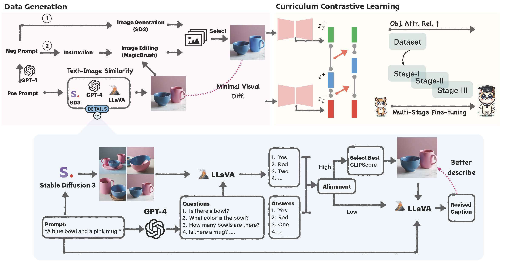
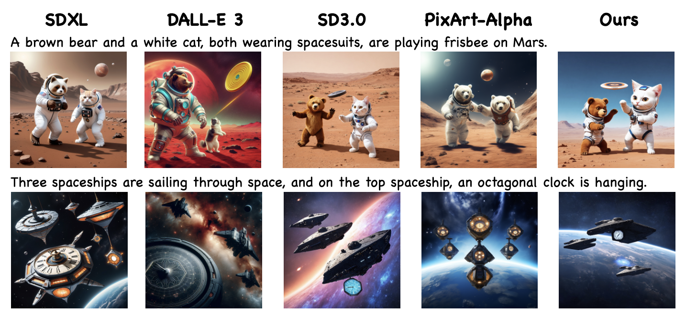
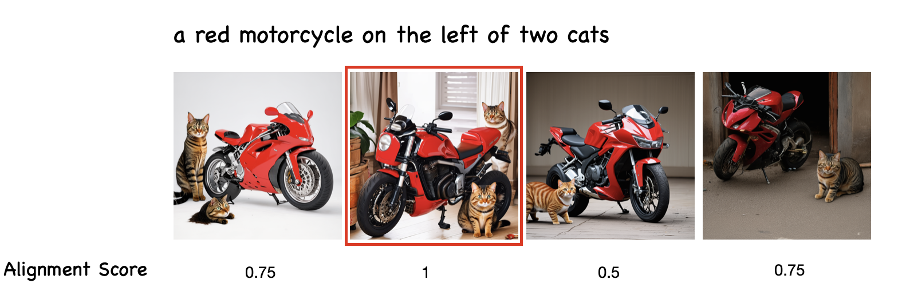
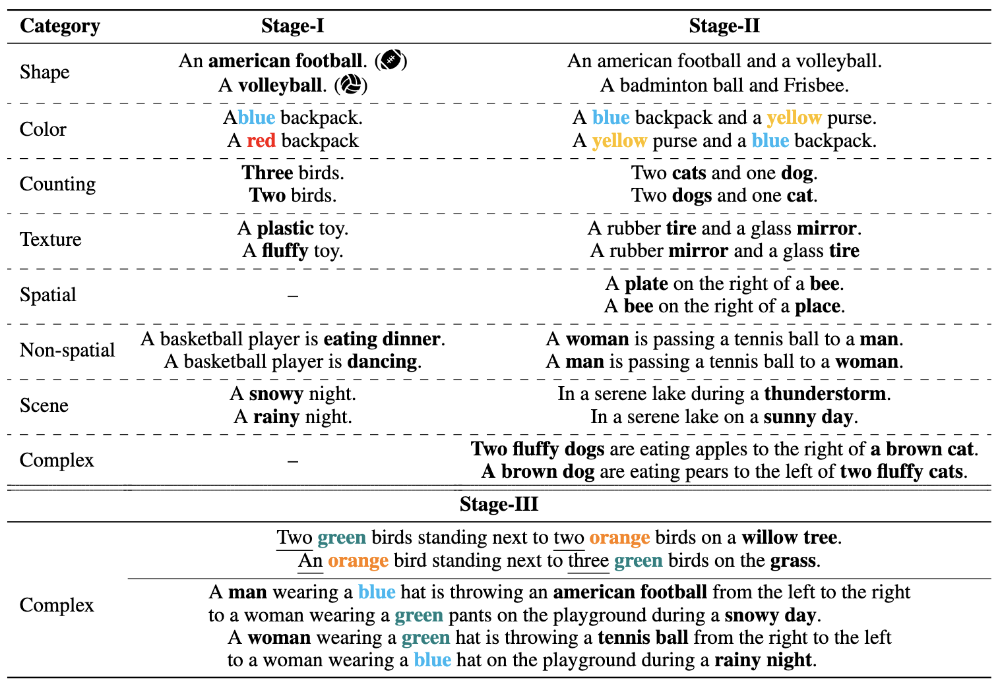

# Progressive Compositionality in Text-to-Image Generative Models

[](https://arxiv.org/pdf/2410.16719)   [](https://evansh666.github.io/EvoGen_Page/)

**This is the official repository for "[Progressive Compositionality in Text-to-Image Generative Models](https://evansh666.github.io/EvoGen_Page/)".**


## ✨ Abstract

Despite the impressive text-to-image (T2I) synthesis capabilities of diffusion models, they often struggle to understand compositional relationships between objects and attributes, especially in complex settings. Existing solutions have tackled these challenges by optimizing the cross-attention mechanism or learning from the caption pairs with minimal semantic changes. However, *can we generate high-quality complex contrastive images that diffusion models can directly discriminate based on visual representations?*

In this work, we leverage largelanguage models (LLMs) to compose realistic, complex scenarios and harness Visual-Question Answering (VQA) systems alongside diffusion models to automatically curate a contrastive dataset, CONPAIR consisting of 15k pairs of high-quality contrastive images. These pairs feature minimal visual discrepancies and cover a wide range of attribute categories, especially complex and natural scenarios. To learn effectively from these error cases, i.e., hard negative images, we propose EVOGEN, a new multi-stage curriculum for contrastive learning of diffusion models. Through extensive experiments across a wide range of compositional scenarios, we showcase the effectiveness of our proposed framework on compositional T2I benchmarks. 

## ✨ Data Construction


**Dataset Construction.** To address attribute binding and compositional generation, we propose a new high-quality contrastive dataset, ConPair. Each sample in ConPair consists of a pair of images associated with a positive caption. We construct captions by GPT-4, covering eight categories of compositionality: color, shape, texture, counting, spatial relationship, non-spatial relationship, scene, and complex.

## ✨ Qualitative Results


<!-- ## ✨ Method

<p align="center">
  
</p>

<p align="center"><strong>Overview of the EvoGen Framework.</strong></p>
 -->
## 🛠️ Environment Setup

- Create Anaconda Environment:
  
  ```bash
  git clone https://github.com/evansh666/EvoGen.git
  cd EvoGen
  ```
  
  ```bash
  conda create -n EvoGen python=3.10
  conda activate EvoGen
  conda install pytorch==2.4.0 torchvision==0.19.0 torchaudio==2.4.0 pytorch-cuda=12.4 -c pytorch -c nvidia
  pip install git+https://github.com/huggingface/diffusers.git
  ```
- Install other requirements:
  
  ```bash
  pip install -U -r requirements.txt
  accelerate config
  ```

## 🔮 Data Construction Pipeline

Given a prompt, to generate and select a faithful image:
  ```bash
  cd data_construction
  python pipeline.py --prompt "A cat and a dog" --categories "counting, object" --num_images 10 --theta 0.9 --sd_model "stabilityai/stable-diffusion-2" --llm_model "gpt-4o" --example_image "dog.png"
  ```
You can also provide your own images and apply our pipeline. 

Here, we show another example of using our pipeline to generate a most faithful image (red squared).


## 🔥 Fine-tuning

- Fine tune on Stable-Diffusion v2
  
  ```bash
  accelerate launch --num_processes=4 finetune.py --pretrained_model_name_or_path=stabilityai/stable-diffusion-2 --train_data_dir=../path/to/dataset --image_column='img' --caption_column='prompt' --resolution=512 --center_crop --random_flip --train_batch_size=1 --gradient_accumulation_steps=4 --gradient_checkpointing --mixed_precision="fp16" --max_train_steps=500 --learning_rate=1e-05 --max_grad_norm=1 --lr_scheduler="constant" --lr_warmup_steps=0 --output_dir=../path/to/checkpoints --contrastive_loss_coeff 0.1 
  ```

## 🏁 Evaluation

- Evaluate with T2I-CompBench
  ```bash
  cd eval/T2I-Compbench
  # follow steps in https://github.com/Karine-Huang/T2I-CompBench.

  cd eval/Attend-and-Excite
   # follow steps in https://github.com/yuval-alaluf/Attend-and-Excite
  ```

## 🧱 Dataset 

<!-- #### ⚠️ Note: we found there are a few of potentially harmful images in the dataset, we are currently reviewing and filtering the dataset. We will republish it very soon. Please stay tuned. -->

- File format
```
    .
    ├── shape
    │   └── metadata.jsonl
    ├── color                    
    ├── counting                     
    ├── texture                    
    ├── spatial                   
    ├── non-spatial
    ├── scene
    └── complex
```
- Meta data download

You can access meta prompts from [google drive](https://drive.google.com/drive/folders/1gd7k8NNRFZi4p00iwTw3LAWytXGstmQD?usp=sharing).

```bash
cd dataset
python data_download.py
```
<!-- https://drive.google.com/drive/folders/1gd7k8NNRFZi4p00iwTw3LAWytXGstmQD?usp=sharing -->
- Example contrastive prompts used in the dataset


<!-- ## Pretrained Weights

- Please download the [pretrained checkpoint](https://drive.google.com/drive/folders/1_au5Eefx4tCyY0jrisdQ8uPw0jyvbLAB?usp=drive_link).

  ```bash
  mkdir ckpts
  mv state_dict.bin ./ckpts 
  ```
   -->

## 🚀 Citation

If you find our work useful, please consider citing:

```
@article{han2024progressivecompositionalitytexttoimagegenerative,
      title={Progressive Compositionality In Text-to-Image Generative Models}, 
      author={Xu Han and Linghao Jin and Xiaofeng Liu and Paul Pu Liang},
      journal={arXiv preprint arXiv:2410.16719},
      year={2024}
}
```

## 📭 Contact

If you have any comments or questions, feel free to contact Xu Han(evanshan69@gmail.com) or Linghao Jin(linghaoj@usc.edu).

## License

Please follow [CC-BY-NC](./LICENSE).

<hr>
